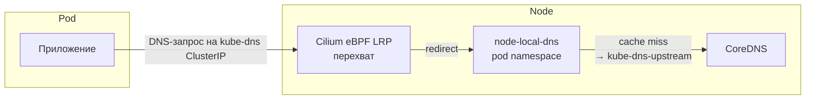

# Установка Cilium CNI

[Cilium](https://cilium.io/) — CNI на базе eBPF, обеспечивает сетевую связность,
сервис-меш и Observability (Hubble) без sidecar-контейнеров.

Поддерживаются два режима:

| Режим | Переменная | kube-proxy | Описание |
| --- | --- | --- | --- |
| Стандартный | `cilium_kube_proxy_replacement: false` | работает | Cilium работает рядом с kube-proxy |
| Замена kube-proxy | `cilium_kube_proxy_replacement: true` | удалён | eBPF-датаплейн полностью заменяет kube-proxy |

## Быстрая настройка

В `group_vars/k8s_cluster`:

```yaml
cni: cilium

# Замена kube-proxy (опционально)
cilium_kube_proxy_replacement: false

# NodeLocal DNS Cache через CiliumLocalRedirectPolicy
cilium_nodelocaldns: true
```

## NodeLocal DNS Cache и Cilium

### Проблема

Стандартный [NodeLocal DNS Cache](https://kubernetes.io/docs/tasks/administer-cluster/nodelocaldns/)
работает в `hostNetwork: true`, слушает на статическом IP (169.254.25.10)
и перехватывает DNS-трафик через правила **iptables**.

При использовании Cilium (особенно в режиме замены kube-proxy) этот подход
**не работает**: Cilium обрабатывает service resolution на уровне eBPF/сокетов
ещё до того, как пакеты достигнут цепочек iptables. В результате DNS-запросы
подов к ClusterIP сервиса `kube-dns` перехватываются Cilium и направляются
напрямую в CoreDNS, минуя node-local-dns.

### Решение — CiliumLocalRedirectPolicy

Вместо iptables используется
[Cilium Local Redirect Policy (LRP)](https://docs.cilium.io/en/stable/network/kubernetes/local-redirect-policy/#node-local-dns-cache)
— нативный механизм Cilium для перехвата трафика на уровне eBPF.



Архитектура решения:

1. **Kubelet** настроен со стандартным `clusterDNS` (IP CoreDNS из `serviceSubnet`)
   — конфигурация node-local-dns из kubeadm убрана.
2. **node-local-dns** разворачивается в **pod namespace** (`hostNetwork: false`),
   слушает на `0.0.0.0:53`, не создаёт dummy-интерфейс и не настраивает iptables
   (флаги `-setupinterface=false -setupiptables=false`).
3. **CiliumLocalRedirectPolicy** с `serviceMatcher` для `kube-dns` перехватывает
   DNS-трафик и перенаправляет его на локальный pod node-local-dns.
4. **kube-dns-upstream** — отдельный ClusterIP-сервис, указывающий на CoreDNS.
   Нужен, чтобы node-local-dns мог обращаться к CoreDNS **в обход LRP**
   (без него возникает цикл: nodelocaldns → kube-dns → LRP → nodelocaldns → …).

### Включение

В `group_vars/k8s_cluster`:

```yaml
cni: cilium
cilium_nodelocaldns: true  # по умолчанию
```

При `cilium_nodelocaldns: true` playbook автоматически:

- включает `localRedirectPolicies.enabled` в Helm values Cilium;
- при сохранённом kube-proxy дополнительно включает `socketLB.enabled`;
- разворачивает node-local-dns DaemonSet в pod namespace;
- создаёт сервис `kube-dns-upstream`;
- применяет `CiliumLocalRedirectPolicy` для `kube-dns`.

### Что меняется в kubeadm-config

Для Cilium секция `clusterDNS` в `KubeletConfiguration` **не задаётся** —
kubeadm вычисляет IP автоматически (первый адрес из `serviceSubnet`).
Это IP сервиса CoreDNS (`kube-dns`), и именно его перехватывает LRP.

Для Calico и Flannel `clusterDNS` остаётся равным `nodelocaldns_local_ip`
(169.254.25.10) — стандартный подход через hostNetwork + iptables.

### Проверка

После установки убедитесь, что LRP работает:

```bash
# CiliumLocalRedirectPolicy применена
kubectl get ciliumlocalredirectpolicies -n kube-system

# LRP видна в cilium agent (замените <cilium-pod>)
kubectl exec -n kube-system <cilium-pod> -- cilium-dbg lrp list

# Сервис kube-dns имеет тип LocalRedirect в eBPF
kubectl exec -n kube-system <cilium-pod> -- cilium-dbg service list | grep -i dns

# Метрики node-local-dns растут при DNS-запросах
kubectl exec -n kube-system <nodelocaldns-pod> -- curl -s localhost:9253/metrics | grep coredns_dns_requests_total
```

### Отключение

Если node-local-dns не нужен:

```yaml
cilium_nodelocaldns: false
```

При этом `localRedirectPolicies` отключается в Helm values, а node-local-dns
DaemonSet и LRP не разворачиваются.

## Замена kube-proxy (kube-proxy-free)

При `cilium_kube_proxy_replacement: true`:

- `kubeadm init` выполняется с `--skip-phases=addon/kube-proxy`
- Cilium настраивается с `kubeProxyReplacement: true`
- Создаётся ConfigMap `kubernetes-services-endpoint` для доступа к API server
  через виртуальный IP (особенно важно при HA)

Для HA-кластера Cilium обращается к API server через `k8sServiceHost`,
который автоматически настраивается на `ha_cluster_virtual_ip`.

Подробнее: [Cilium — kube-proxy replacement](https://docs.cilium.io/en/stable/network/kubernetes/kubeproxy-free/)

## Управление после установки

| Действие | Команда |
| --- | --- |
| Статус Cilium | `cilium status` (из pod cilium) |
| Список LRP | `cilium-dbg lrp list` |
| Сервисы в eBPF | `cilium-dbg service list` |
| Hubble UI | включить `hubble.ui.enabled: true` в Helm values |
| Connectivity test | `cilium connectivity test` |

## Ссылки

- [Cilium Documentation](https://docs.cilium.io/en/stable/)
- [Local Redirect Policy](https://docs.cilium.io/en/stable/network/kubernetes/local-redirect-policy/)
- [NodeLocal DNS Cache (Cilium)](https://docs.cilium.io/en/stable/network/kubernetes/local-redirect-policy/#node-local-dns-cache)
- [kube-proxy Replacement](https://docs.cilium.io/en/stable/network/kubernetes/kubeproxy-free/)
- [Cilium Helm Reference](https://docs.cilium.io/en/stable/helm-reference/)
