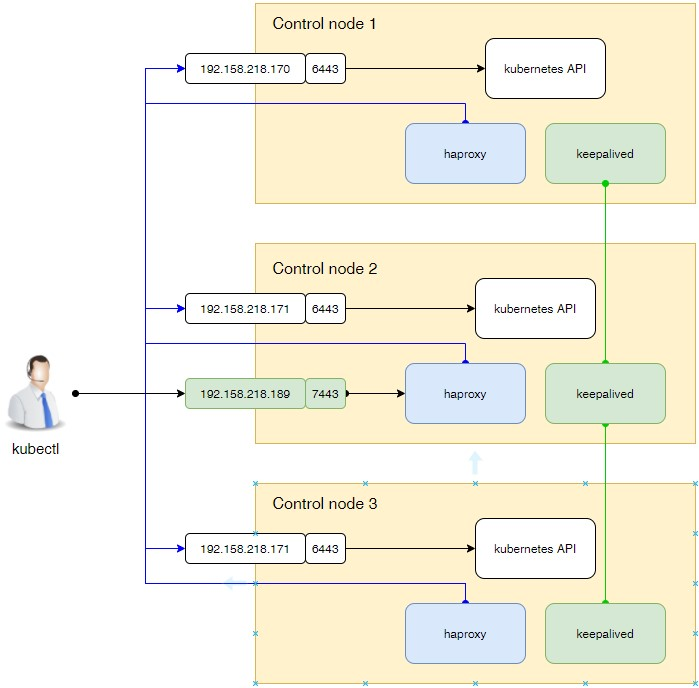

# Ansible playbook для установки тестового кластера k8s

В данный момент поддерживает:

- Kubernetes v1.31. Предыдущие версии не поддерживаются.
- Установку одной или несколько control nodes.
- HA доступ к API kubernetes.
- containerd, CRI-O.
- calico.
- В KubeProxyConfiguration установлены параметры для работы Metallb.
- nodelocaldns - кеширующий DNS сервер на каждой ноде кластера.

По идее, работает только с RedHat версиями дистрибутивов. Оттестировано на Rocky Linux 9.

## Установка ansible

Так получилось, что у меня в WSL2 стоит Ubuntu:

```shell
python3 -m venv venv
. ~/venv/bin/activate
pip3 install "ansible-core<2.17"
```

Генерируем ssh ключ:

```shell
ssh-keygen
```

Копируем ключики в виртуальные машины из [hosts.yaml](hosts.yml):

 ```shell
ssh-copy-id root@control1.kryukov.local
ssh-copy-id root@control2.kryukov.local
ssh-copy-id root@control3.kryukov.local
ssh-copy-id root@worker1.kryukov.local
ssh-copy-id root@worker2.kryukov.local
ssh-copy-id root@worker3.kryukov.local
```

## Конфигурационные параметры

* [Инвентори](hosts.yaml).
* [Общая конфигурация](group_vars/k8s_cluster).

## Установка

### k8s с одной control node

В [инвентори](hosts.yaml) в группе `k8s_masters` необходимо указать только один хост.

```shell
ansible-playbook install-cluster.yaml
```

### k8s с несколькими control nodes

В [инвентори](hosts.yaml) в группе `k8s_masters` необходимо указать **нечётное количество
control nodes**.

```shell
ansible-playbook install-cluster.yaml
```

### k8s c HA

Используются haproxy и keepalived.



В конфигурационном файле определите параметры доступа к API :

* `ha_cluster_virtual_ip` - виртуальный IP адрес.
* `ha_cluster_virtual_port` - порт. Не должен быть равен 6443.

## Удалить кластер

```shell
ansible-playbook reset.yaml
```

**Внимание!!!** Скрипт удаляет **все** нестандартные цепочки и чистит все стандартные цепочки.

## Апдейт кластера

Изменяете версию кластера в `group_vars\k8s_cluster` и запускаете апдейт.

```shell
ansible-playbook upgrade.yaml
```

## Сервисные функции

Сервисные функции находятся в директории `services`