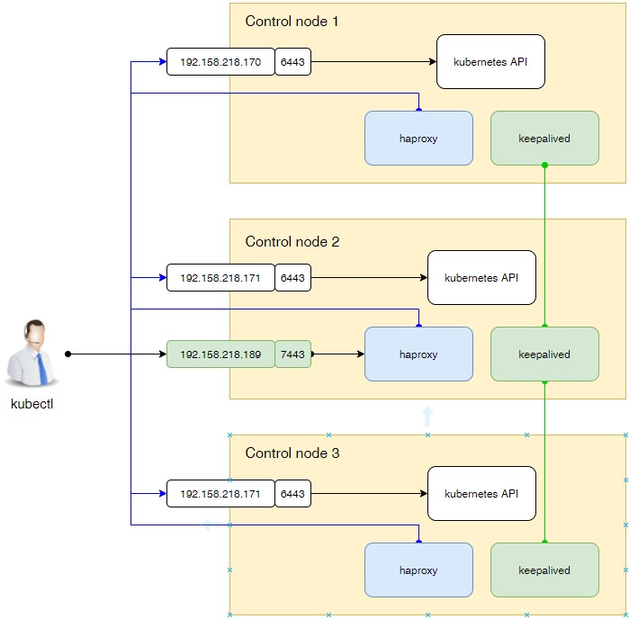

# Ansible playbook для установки тестового кластера k8s

Плейбук проверяется на наборе [приложений](https://github.com/BigKAA/youtube/tree/master/1.31).

| k8s ver         | Distributive    | CRI             | Notes           |
|-----------------|-----------------|-----------------|-----------------|
| 1.35.0 → 1.36.1 | Rocky Linux 10.1 | containerd | **OK** |
| 1.32            | Debian 12 | CRI-O 1.32   | *Не стартует harbor.* |
| 1.31            | Ubuntu 22.04.4 LTS | CRI-O 1.31   |  *Не стартует harbor. Не монтируется emptyDir.* |
| 1.3x            | Ubuntu 22.04.4 LTS | containerd 1.7.12  | С последним обновление должен работать. *На проверке* |
| 1.31.2          | Rocky Linux 9.4 | containerd 1.7.23-3.1 | **OK** |
| 1.31            | Rocky Linux 8.10 | CRI-O 1.31 | *Не стартует harbor. Не монтируется emptyDir.*  |
| 1.31            | Rocky Linux 8.10 | containerd 1.6.32 | **OK** *Приложения пока не тестил* |
| 1.30            | Rocky Linux 8.10 | containerd 1.6.32 | **OK** |
| 1.31            | Debian 12 | containerd.io 1.7.21 | Кластер стартует. Не работает metallb. |
| 1.30            | Debian 12 | containerd.io 1.7.21 | **Ok** |

Остальные дистрибутивы проверю, когда до них руки дойдут.

Поддерживает:

- Kubernetes v1.28 — v1.36.
- Установку одной или несколько control nodes.
- HA доступ к API kubernetes.
- CRI-O.
- calico.
- В KubeProxyConfiguration установлены параметры для работы Metallb.
- nodelocaldns - кеширующий DNS сервер на каждой ноде кластера.
- External etcd кластер (опционально).

## Установка ansible

Так получилось, что у меня в WSL2 стоит Ubuntu:

```shell
python3 -m venv venv
. ~/venv/bin/activate
pip3 install "ansible-core<2.17"
```

Или используем контейнер с Ansible:

```shell
docker pull alpine/ansible:2.17.0
mkdir -p ~/.ansible
alias ansible-playbook="docker run -ti --rm -v ~/.ssh:/root/.ssh -v ~/.ansible:/root/.ansible -v $(pwd):/apps -w /apps alpine/ansible:2.17.0 ansible-playbook"
ansible-playbook --version
```

Генерируем ssh ключ:

```shell
ssh-keygen
```

Копируем ключики в виртуальные машины из [hosts.yaml](hosts.yml):

 ```shell
ssh-copy-id root@control1.kryukov.local
ssh-copy-id root@control2.kryukov.local
ssh-copy-id root@control3.kryukov.local
ssh-copy-id root@worker1.kryukov.local
ssh-copy-id root@worker2.kryukov.local
ssh-copy-id root@worker3.kryukov.local
```

## Конфигурационные параметры

- [Инвентори](hosts.yaml).
- [Общая конфигурация](group_vars/k8s_cluster).

## Установка

### k8s с одной control node

В [инвентори](hosts.yaml) в группе `k8s_masters` необходимо указать только один хост.

```shell
ansible-playbook install-cluster.yaml
```

### k8s с несколькими control nodes

В [инвентори](hosts.yaml) в группе `k8s_masters` необходимо указать **нечётное количество
control nodes**.

```shell
ansible-playbook install-cluster.yaml
```

### k8s c HA

Используются haproxy и keepalived.



В конфигурационном файле определите параметры доступа к API :

- `ha_cluster_virtual_ip` - виртуальный IP адрес.
- `ha_cluster_virtual_port` - порт. Не должен быть равен 6443.

## Удалить кластер

```shell
ansible-playbook reset.yaml
```

**Внимание!!!** Скрипт удаляет **все** нестандартные цепочки и чистит все стандартные цепочки.

## Апдейт кластера

Изменяете версию кластера в `group_vars\k8s_cluster` и запускаете апдейт.

```shell
ansible-playbook upgrade.yaml
```

## Utils playbook

Playbook с утилитами. [Обычный набор утилит](https://github.com/BigKAA/youtube/tree/master/1.31), который я ставлю в тестовых кластерах. Раньше ставил руками. Надоело, решил автоматизировать.

```shell
ansible-playbook services/06-utils.yaml
```

## External etcd

По умолчанию используется встроенный (stacked) etcd, который работает на control plane нодах.
При необходимости можно вынести etcd на отдельные ноды.

### Конфигурация

В `group_vars/k8s_cluster` установите:

```yaml
etcd_mode: "external"
```

### Инвентори

В `hosts.yaml` добавьте группу `etcd_nodes` с **нечётным** количеством нод (рекомендуется 3):

```yaml
etcd_nodes:
  hosts:
    e1.kryukov.lan:
      ansible_host: 192.168.218.141
      etcd_short_name: e1
    e2.kryukov.lan:
      ansible_host: 192.168.218.142
      etcd_short_name: e2
    e3.kryukov.lan:
      ansible_host: 192.168.218.143
      etcd_short_name: e3
```

### Матрица совместимости Kubernetes ↔ etcd

| Kubernetes | etcd |
| --- | --- |
| 1.28 | 3.5.9 |
| 1.29 | 3.5.10 |
| 1.30 | 3.5.12 |
| 1.31 | 3.5.13 |
| 1.32 | 3.5.16 |
| 1.33 | 3.5.16 |
| 1.34 | 3.5.16 |
| 1.35 | 3.5.24 |
| 1.36 | 3.6.6 |

Версия etcd определяется автоматически по `kube_version`.
При необходимости можно переопределить:

```yaml
etcd_image: "registry.k8s.io/etcd:3.6.6-0"
```

### Очистка external etcd

При удалении кластера (`reset.yaml`) external etcd **не удаляется** по умолчанию.
Для очистки установите:

```yaml
reset_etcd: true
```

## Сервисные функции

Сервисные функции находятся в директории `services`
